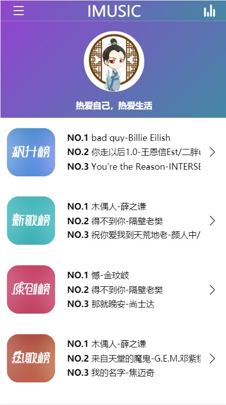
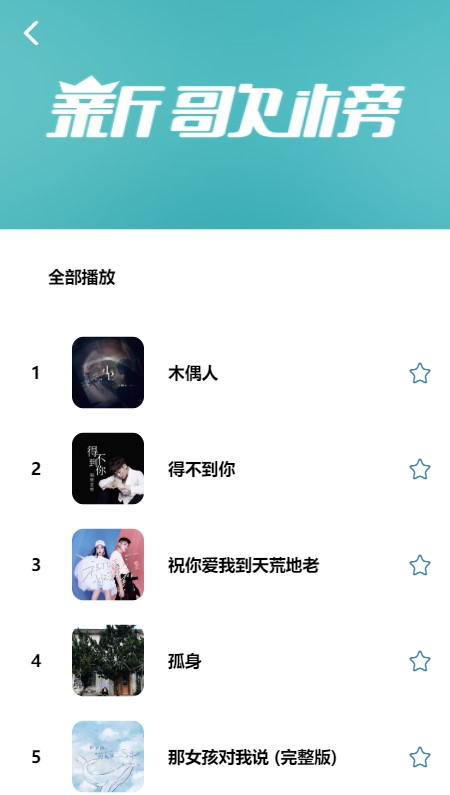
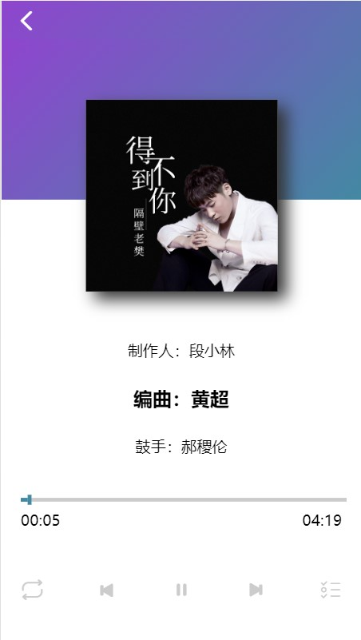
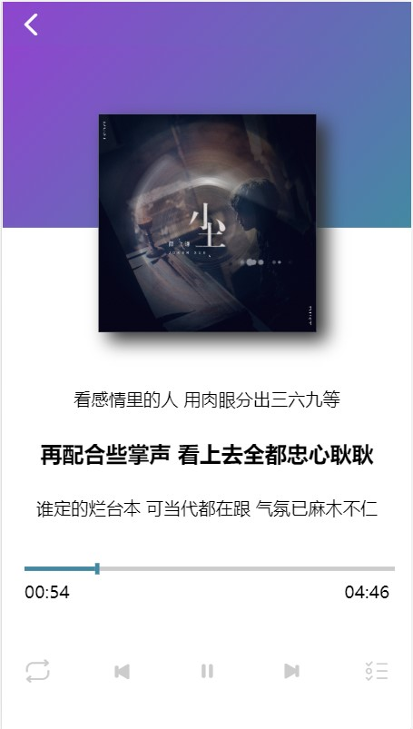

# iMusic Demo
* 一个自己进行的简单设计，自己敲代码实现的简单音乐播放器，`不用于商业`，只是自己的一个学习实践
* 在线演示地址：[iMusic](https://y-unfettered.github.io/iMusicShow/)，因为使用了`Google`的`firebase`，但由于是`Google`的服务，所以需要`科学上网`才能实现获取播放列表实现播放

## iMusic实现了哪些？
* 数据的获取是根据大神提供的[网易云API](https://github.com/Binaryify/NeteaseCloudMusicApi)获取的音乐数据
* 选取的是排行榜，对数据进行一个筛选，只选择了网易的四大榜单
    *   `飙升榜`
    *   `新歌榜`
    *   `原创榜`
    *   `热歌榜`
* ~~利用`野狗云`实现播放列表~~
* 利用`firebase`实现播放列表
* 利用`audio`本身的一些接口实现: 
```javascript
    @play="onPlay" //播放时触发onPlay方法
    @pause="onPause" //暂停时触发onPause方法
    @timeupdate="updateTime" //播放位置发生改变时触发updateTime方法
    @loadedmetadata="onLoadedmetadata" //开始播放前，预加载完成触发onLoadedmetadata方法
    @ended="onEnd" //歌曲结束后触发onEnd方法
    autoplay //自动播放，但是之前Chrome更新后，就不支持了
```
* 功能介绍:
    * 播放/暂停
    * 上一曲/下一曲
    * 播放列表的点击播放
    * 播放模式选择: 顺序播放/随机播放/单曲循环
    * 歌词滚动，当前句的加粗放大
    * 播放列表歌曲的删除，单一删除和全部删除
    * 通过排行榜进行歌曲列表添加，单一添加和全部添加，通过简单的判断来保证不重复添加

## 技术栈
* vue
* vue-router
* vuex
* vuescroll

## 效果图






## 2019/06/28 更新
* 由于`野狗云`的关闭服务了，所以改使用了`Google`的`firebase`，但由于是`Google`的服务，所以需要`科学上网`
* 使用HBuilder打包了一个apk文件，可以在安卓手机上使用
